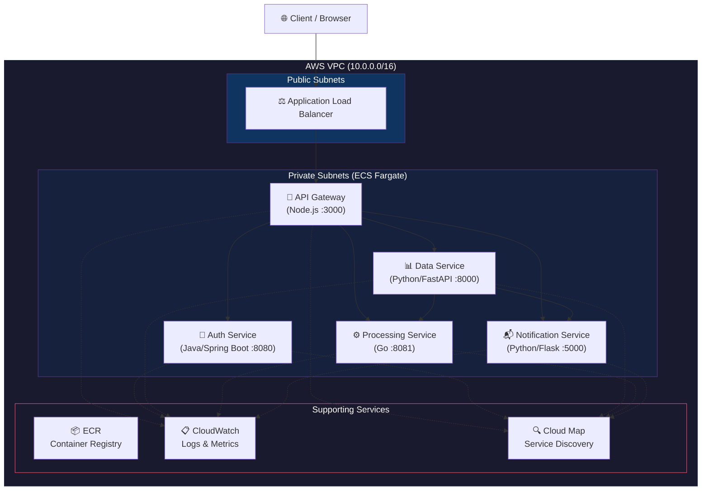

<p align="center">
  <h1 align="center">🏗️ Damolak Microservices Platform</h1>
  <p align="center">
    <strong>Production-ready, polyglot microservices architecture deployed on AWS ECS Fargate</strong>
  </p>
  <p align="center">
    <a href="#architecture">Architecture</a> •
    <a href="#services">Services</a> •
    <a href="#getting-started">Getting Started</a> •
    <a href="#deployment">Deployment</a> •
    <a href="#cicd">CI/CD</a> •
    <a href="#design-decisions">Design Decisions</a>
  </p>
</p>

<p align="center">
  
  
  
  
  
  
  
  
</p>

---

## 📋 Overview

Damolak is a **5-service microservices platform** built with four different programming languages, demonstrating real-world polyglot architecture patterns. Each service is independently deployable, containerized with Docker, and orchestrated on **AWS ECS Fargate** with full infrastructure-as-code using **Terraform**.

### Key Highlights

- **5 microservices** across 4 languages (Node.js, Java, Python, Go)
- **Zero-downtime deployments** via ECS rolling updates
- **Service discovery** using AWS Cloud Map for inter-service communication
- **Fully automated CI/CD** with GitHub Actions
- **Infrastructure as Code** with modular Terraform
- **Centralized logging** via CloudWatch with structured JSON
- **Production-grade security** — non-root containers, security groups, rate limiting

---

## 🏛️ Architecture

<a name="architecture"></a>



### Request Flow

```
Client → ALB (Port 80) → API Gateway (Port 3000)
                              ├── /api/auth/*    → Auth Service (8080)
                              ├── /api/data/*    → Data Service (8000)
                              ├── /api/processing/* → Processing Service (8081)
                              └── /api/notify/*  → Notification Service (5000)
```

---

## 🔧 Services

<a name="services"></a>

| Service | Language | Framework | Port | Role |
|---------|----------|-----------|------|------|
| **API Gateway** | Node.js | Express | 3000 | Entry point, request routing, rate limiting |
| **Auth Service** | Java 17 | Spring Boot 3.2 | 8080 | JWT authentication, user management |
| **Data Service** | Python 3.12 | FastAPI | 8000 | CRUD operations, business logic |
| **Processing Service** | Go 1.21 | gorilla/mux | 8081 | Background job processing (goroutine pool) |
| **Notification Service** | Python 3.12 | Flask | 5000 | Event notifications, audit logging |

### Service Communication

- **API Gateway → All Services**: HTTP REST (reverse proxy)
- **Data Service → Processing Service**: Async job dispatch with callback
- **Data Service → Notification Service**: Event notifications on CRUD operations
- **Processing Service → Data Service**: Callback on job completion

---

## 📁 Project Structure

```
damolak-microservices/
│
├── services/
│   ├── api-gateway/              # Node.js (Express)
│   │   ├── src/
│   │   │   ├── app.js            # Express app with proxy routing
│   │   │   ├── server.js         # Entry point + graceful shutdown
│   │   │   ├── config/           # Centralized configuration
│   │   │   └── utils/            # Logger
│   │   ├── __tests__/            # Jest tests
│   │   ├── Dockerfile            # Multi-stage build
│   │   └── package.json
│   │
│   ├── auth-service/             # Java (Spring Boot)
│   │   ├── src/main/java/com/damolak/auth/
│   │   │   ├── controller/       # Auth + Health endpoints
│   │   │   ├── service/          # JWT generation & validation
│   │   │   ├── model/            # Request/Response DTOs
│   │   │   └── config/           # Security config
│   │   ├── src/main/resources/   # application.yml
│   │   ├── src/test/             # Spring Boot tests
│   │   ├── Dockerfile            # Maven multi-stage build
│   │   └── pom.xml
│   │
│   ├── data-service/             # Python (FastAPI)
│   │   ├── app/
│   │   │   ├── main.py           # FastAPI app + CRUD routes
│   │   │   ├── models.py         # Pydantic models
│   │   │   └── config.py         # Settings
│   │   ├── tests/                # Pytest tests
│   │   ├── Dockerfile
│   │   └── requirements.txt
│   │
│   ├── processing-service/       # Go (gorilla/mux)
│   │   ├── main.go               # Server + worker pool
│   │   ├── Dockerfile            # Static binary build
│   │   ├── go.mod
│   │   └── go.sum
│   │
│   └── notification-service/     # Python (Flask)
│       ├── app/
│       │   └── main.py           # Flask app + notification handling
│       ├── tests/                # Pytest tests
│       ├── Dockerfile
│       └── requirements.txt
│
├── terraform/
│   ├── modules/
│   │   ├── vpc/                  # VPC, subnets, NAT, IGW
│   │   ├── ecs/                  # Cluster, tasks, services, IAM
│   │   ├── alb/                  # Load balancer, target groups
│   │   └── ecr/                  # Container registries
│   ├── main.tf                   # Root module composition
│   ├── variables.tf              # Input variables
│   └── outputs.tf                # Output values
│
├── .github/workflows/
│   └── deploy.yml                # CI/CD pipeline
│
├── docker-compose.yml            # Local development
├── .gitignore
└── README.md
```

---

## 🚀 Getting Started

<a name="getting-started"></a>

### Prerequisites

| Tool | Version | Purpose |
|------|---------|---------|
| Docker | 24+ | Container runtime |
| Docker Compose | 2.20+ | Local orchestration |
| AWS CLI | 2.x | AWS management |
| Terraform | 1.5+ | Infrastructure provisioning |
| Node.js | 20 LTS | API Gateway development |
| Java | 17 | Auth Service development |
| Python | 3.12 | Data/Notification development |
| Go | 1.21+ | Processing Service development |

### Local Development

1. **Clone the repository**
   ```bash
   git clone https://github.com/damolak/microservices-platform.git
   cd microservices-platform
   ```

2. **Start all services**
   ```bash
   docker-compose up --build
   ```

3. **Verify services are running**
   ```bash
   # API Gateway health (aggregated)
   curl http://localhost:3000/health

   # Individual service health
   curl http://localhost:8080/health   # Auth Service
   curl http://localhost:8000/health   # Data Service
   curl http://localhost:8081/health   # Processing Service
   curl http://localhost:5000/health   # Notification Service
   ```

4. **Test the API flow**
   ```bash
   # Register a user
   curl -X POST http://localhost:3000/api/auth/register \
     -H "Content-Type: application/json" \
     -d '{"username":"testuser","password":"password123"}'

   # Login and get JWT
   curl -X POST http://localhost:3000/api/auth/login \
     -H "Content-Type: application/json" \
     -d '{"username":"testuser","password":"password123"}'

   # Create a data item (triggers processing + notification)
   curl -X POST http://localhost:3000/api/data/items \
     -H "Content-Type: application/json" \
     -d '{"title":"Test Item","payload":{"key":"value"},"priority":"high"}'

   # List data items
   curl http://localhost:3000/api/data/items

   # Check processing stats
   curl http://localhost:8081/stats

   # Check notifications
   curl http://localhost:5000/notifications
   ```

5. **Stop all services**
   ```bash
   docker-compose down -v
   ```

---

## ☁️ Deployment

<a name="deployment"></a>

### AWS Infrastructure Setup

1. **Configure AWS credentials**
   ```bash
   aws configure
   ```

2. **Initialize Terraform**
   ```bash
   cd terraform
   terraform init
   ```

3. **Review the plan**
   ```bash
   terraform plan -out=tfplan
   ```

4. **Apply infrastructure**
   ```bash
   terraform apply tfplan
   ```

5. **Note the outputs**
   ```bash
   terraform output
   # → alb_dns_name = "damolak-production-alb-123456.us-east-1.elb.amazonaws.com"
   # → ecr_repository_urls = { ... }
   ```

### First-Time Image Push

After infrastructure is created, build and push initial images:

```bash
# Login to ECR
aws ecr get-login-password --region us-east-1 | \
  docker login --username AWS --password-stdin <account-id>.dkr.ecr.us-east-1.amazonaws.com

# Build and push each service
for service in api-gateway auth-service data-service processing-service notification-service; do
  cd services/$service
  docker build -t damolak-production-$service .
  docker tag damolak-production-$service:latest \
    <account-id>.dkr.ecr.us-east-1.amazonaws.com/damolak-production-$service:latest
  docker push <account-id>.dkr.ecr.us-east-1.amazonaws.com/damolak-production-$service:latest
  cd ../..
done
```

### Teardown

```bash
cd terraform
terraform destroy
```

---

## 🔄 CI/CD Pipeline

<a name="cicd"></a>

The pipeline is fully automated via **GitHub Actions** and triggers on every push to `main`.


### Pipeline Stages

| Stage | Description | Matrix Strategy |
|-------|-------------|-----------------|
| **Test** | Runs unit tests for all services in parallel | Node.js, Java, Python (4 jobs) |
| **Build & Push** | Builds Docker images and pushes to ECR | All 5 services in parallel |
| **Deploy** | Forces new ECS deployment and waits for stability | Sequential per service |

### Required GitHub Secrets

| Secret | Description |
|--------|-------------|
| `AWS_ROLE_ARN` | IAM role ARN for OIDC-based authentication |

---

## 🧠 Design Decisions

<a name="design-decisions"></a>

### Why Polyglot?

| Service | Language | Rationale |
|---------|----------|-----------|
| API Gateway | **Node.js** | Non-blocking I/O is ideal for proxying concurrent requests |
| Auth Service | **Java** | Mature ecosystem for security; BCrypt, JWT libraries battle-tested |
| Data Service | **Python** | FastAPI's async support + Pydantic validation reduces boilerplate |
| Processing Service | **Go** | Goroutines provide lightweight concurrency for worker pools at ~2KB/goroutine |
| Notification Service | **Python** | Flask simplicity for a focused event-logging service |

### Architecture Decisions

| Decision | Choice | Reasoning |
|----------|--------|-----------|
| **Container Orchestration** | ECS Fargate | No EC2 management, pay-per-use, built-in ALB integration |
| **Service Discovery** | AWS Cloud Map | Native DNS resolution avoids hardcoded IPs between services |
| **API Pattern** | Gateway + Reverse Proxy | Single entry point simplifies auth, rate limiting, and CORS |
| **Inter-service Communication** | HTTP REST | Simplest reliable pattern; no message broker overhead for this scale |
| **Async Processing** | Callback pattern | Data Service dispatches jobs and receives results via HTTP callbacks |
| **Logging** | Structured JSON → CloudWatch | ECS awslogs driver captures stdout; JSON enables CloudWatch Insights queries |
| **Security** | Non-root containers + SGs | Least-privilege principle; ECS tasks in private subnets with NAT |
| **IaC Structure** | Modular Terraform | Each concern (VPC, ECS, ALB, ECR) is independently reusable |
| **CI/CD** | GitHub Actions + OIDC | No long-lived AWS credentials; OIDC role assumption is more secure |
| **Image Strategy** | Multi-stage builds | Minimizes image size: Go ~15MB, Node ~150MB, Java ~300MB, Python ~200MB |

### Network Topology

```
┌─────────────────────────────────────────────────────────┐
│                     VPC (10.0.0.0/16)                   │
│                                                         │
│  ┌─────────────────────────────────────────────┐        │
│  │  Public Subnets (10.0.1.0/24, 10.0.2.0/24) │        │
│  │  ┌─────────┐  ┌──────────┐                  │        │
│  │  │   ALB   │  │ NAT GW   │                  │        │
│  │  └────┬────┘  └────┬─────┘                  │        │
│  └───────┼─────────────┼───────────────────────┘        │
│          │             │                                 │
│  ┌───────┼─────────────┼───────────────────────┐        │
│  │  Private Subnets (10.0.10.0/24, 10.0.11.0/24)       │
│  │       │             │                        │        │
│  │  ┌────▼────┐   ┌────▼────┐                  │        │
│  │  │   ECS   │   │   ECS   │  (Fargate Tasks) │        │
│  │  │ Tasks   │   │ Tasks   │                   │        │
│  │  │ (AZ-1)  │   │ (AZ-2)  │                   │        │
│  │  └─────────┘   └─────────┘                   │        │
│  └──────────────────────────────────────────────┘        │
│                                                         │
│  Internet Gateway ←→ Public Subnets (inbound)           │
│  NAT Gateway ←→ Private Subnets (outbound only)         │
└─────────────────────────────────────────────────────────┘
```

---

## 📊 Monitoring & Logging

### CloudWatch Log Groups

Each service has a dedicated log group with 30-day retention:

| Service | Log Group |
|---------|-----------|
| API Gateway | `/ecs/damolak-production/api-gateway` |
| Auth Service | `/ecs/damolak-production/auth-service` |
| Data Service | `/ecs/damolak-production/data-service` |
| Processing Service | `/ecs/damolak-production/processing-service` |
| Notification Service | `/ecs/damolak-production/notification-service` |

### Useful CloudWatch Insights Queries

```sql
-- Find all errors across services
fields @timestamp, @message
| filter @message like /error/i
| sort @timestamp desc
| limit 50

-- Request latency by service
fields @timestamp, service, @message
| filter @message like /response_time/
| stats avg(response_time) by service

-- Track specific request across services
fields @timestamp, service, @message
| filter @message like /request_id="abc-123"/
| sort @timestamp asc
```

---

## ⚠️ Assumptions

- AWS account with appropriate permissions is pre-configured
- GitHub repository has OIDC provider configured for AWS role assumption
- Docker is available locally for development
- Single NAT Gateway is acceptable (cost optimization over HA)
- In-memory data stores are used for demonstration (not persistent)
- JWT secret is passed via environment variables (use AWS Secrets Manager in production)

---

## 🚧 Limitations

- **No persistent storage**: All services use in-memory stores. Production requires RDS/DynamoDB.
- **Single NAT Gateway**: Provides cost savings but is a single point of failure for outbound traffic.
- **No HTTPS**: ALB listener is HTTP only. Production requires ACM certificate + HTTPS listener.
- **No auto-scaling**: ECS services have fixed `desired_count`. Add Application Auto Scaling policies.
- **No secrets management**: JWT secrets are in environment variables. Use AWS Secrets Manager + ECS secrets.
- **No message queue**: Inter-service communication is synchronous HTTP. Consider SQS/SNS for true async.

---

## 🔮 Future Improvements

- [ ] **Add HTTPS** — ACM certificate + ALB HTTPS listener + HTTP→HTTPS redirect
- [ ] **Persistent storage** — RDS PostgreSQL for Data Service, DynamoDB for Auth Service
- [ ] **Auto-scaling** — ECS Service Auto Scaling based on CPU/memory/custom metrics
- [ ] **API versioning** — `/api/v1/` prefix with backward compatibility
- [ ] **Message queue** — Amazon SQS between Data and Processing services for durability
- [ ] **Secrets Manager** — Move JWT secrets, DB credentials to AWS Secrets Manager
- [ ] **WAF** — AWS WAF on ALB for DDoS protection and IP filtering
- [ ] **Distributed tracing** — AWS X-Ray integration for end-to-end request tracing
- [ ] **Terraform remote state** — S3 backend with DynamoDB locking for team workflows
- [ ] **Multi-environment** — Terraform workspaces or separate state files for dev/staging/prod
- [ ] **Database migrations** — Flyway (Java) / Alembic (Python) for schema versioning
- [ ] **gRPC** — Replace REST with gRPC for high-throughput inter-service calls

---

## 📄 License

This project is licensed under the MIT License.

---

<p align="center">
  <sub>Built with ❤️ by <strong>Itoje Dollars Efe</strong></sub>
</p>
